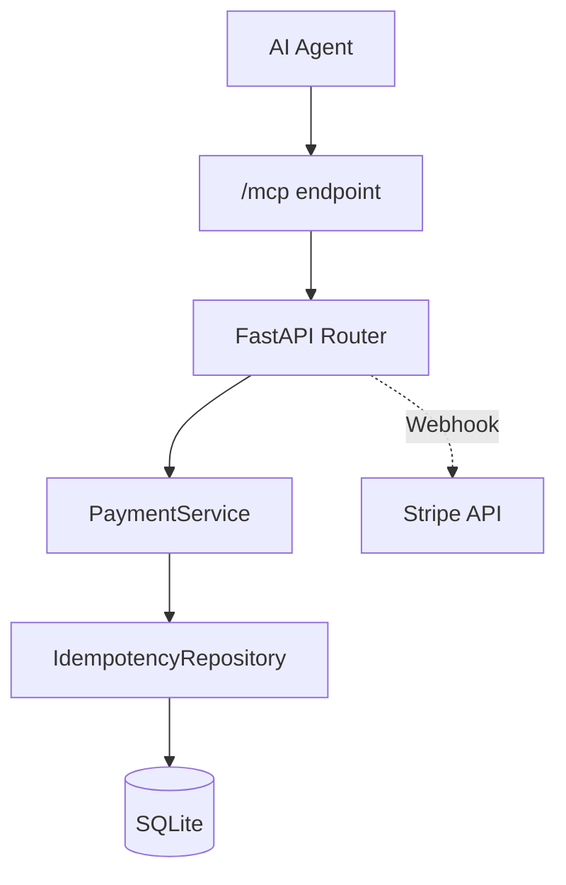

# Stripe MCP Server

Production-grade Stripe integration for AI agents using the Model Context Protocol (MCP).

This server exposes Stripe payment operations as MCP tools with strict idempotency, webhook verification and audit-ready behavior.

---

## What this is

A FastAPI server that allows AI agents to safely interact with Stripe in production environments.

It provides:

* Deterministic payment execution
* Persistent idempotency
* Verified Stripe webhooks
* MCP-compatible tool interface
* Audit-friendly flows

---

## What this is not

* Not a Stripe SDK
* Not a tutorial
* Not a demo project

This repository exists to run in production.

---

## Core features

* Stripe PaymentIntents integration
* End-to-end idempotency enforcement
* HMAC verified webhooks
* MCP tool exposure
* Role-based tool risk separation
* E2E test coverage
* CI regression protection

---

## Architecture

```
AI Agent
   ↓
MCP Client
   ↓
Stripe MCP Server (FastAPI)
   ↓
Stripe API + Webhooks
```

The agent never talks directly to Stripe.

All payments go through this server.

---

## MCP tools

| Tool                   | Description                   | Risk   |
| ---------------------- | ----------------------------- | ------ |
| create_payment_intent  | Create a Stripe PaymentIntent | Medium |
| confirm_payment_intent | Confirm with idempotency      | Medium |
| handle_webhook         | Process verified webhook      | Low    |
| refund_payment         | Refund a payment              | High   |
| list_intents           | Query intents                 | Low    |

High-risk tools must be restricted by role or environment.

---

## Security model

* Webhook signatures verified using Stripe HMAC
* Idempotency keys enforced at request and webhook level
* Deterministic responses
* No duplicated side effects
* Audit-ready logs

---

## Quick start

```bash
git clone https://github.com/julian-najas/stripe-mcp-server
cd stripe-mcp-server
cp .env.example .env
pip install -e .
uvicorn app.main:app --reload
```

Set your Stripe test keys in `.env`.

The MCP server will be available for any MCP-compatible client using `server.json`.

---

## Example flow

1. Agent requests a payment creation
2. MCP tool calls create_payment_intent
3. Frontend confirms
4. Stripe webhook arrives
5. Signature is verified
6. Idempotency is enforced
7. Agent updates user state

Every step is deterministic and auditable.

---

## Testing

The repository includes:

* Unit tests
* Integration tests
* End-to-end Stripe flows
* CI coverage reporting

---

## Deployment

The server is container-ready and compatible with Railway, Docker and standard ASGI deployments.

---

## License

MIT

---

## Status

This repository represents a production-grade MCP payment server.

---


## Agent roles

| Role      | Permissions         |
|-----------|---------------------|
| read_only | list_intents        |
| payments  | create, confirm     |
| admin     | refunds             |

Role is resolved from ENV or upstream agent identity.

**Stripe payments for AI agents in production.  
Idempotency. Verified webhooks. Audit-ready.**

Not a demo.  
Not an SDK.  
Operational infrastructure.


## Guarantees

- Core logic covered by tests
- Webhooks verified with HMAC
- Idempotency enforced
- CI blocks regression

## What this server solves

Stripe integrations usually fail in production because of:

- Retries with different payloads
- Duplicated webhooks
- Partial failures
- Agent hallucinations calling payment tools

This server enforces:

- Persistent idempotency
- Webhook signature verification
- Deterministic responses
- E2E tested payment flows

---

## MCP Identity

This server exposes a Model Context Protocol interface for AI agents.

It can be consumed by any MCP-compatible client using `server.json`.

---

## Tool risk model

| Tool | Description | Risk |
| ------ | ------------- | ------ |
| create_payment_intent | Create Stripe PaymentIntent | Medium |
| confirm_payment_intent | Confirm intent with idempotency | Medium |
| handle_webhook | Consume verified webhook | Low |
| refund_payment | Refund an intent | High |
| list_intents | Query intents | Low |

High-risk tools must be restricted by role or environment.

---

## Quickstart — 5 minutes


```bash
git clone https://github.com/julian-najas/stripe-mcp-server
cd stripe-mcp-server
cp .env.example .env
pip install -e ".[dev]"
uvicorn app.main:app --reload
# Set Stripe test keys in .env
```




Your MCP Stripe server is now running.

## Example flow — SaaS subscription

1. Agent receives: "Create 29€/month subscription for user@email.com"
2. list_customers(email)
3. create_payment_intent(amount=2900, customer_id)
4. Frontend confirms
5. Webhook validates
6. Agent updates user status

Every step is idempotent and auditable.
